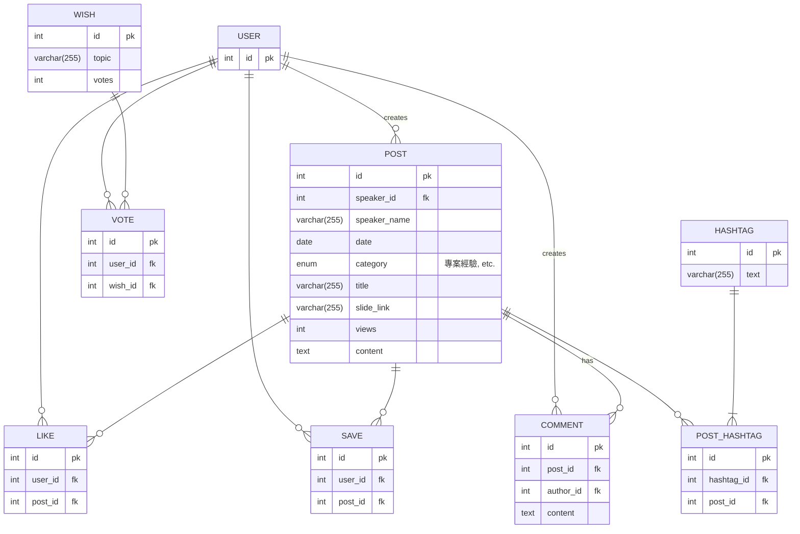

```mermaid
erDiagram

USER ||--o{ POST: creates
USER ||--o{ COMMENT: creates
USER ||--o{ LIKE: ""
USER ||--o{ SAVE: ""
USER ||--o{ VOTE: ""
POST ||--o{ LIKE: ""
POST ||--o{ SAVE: ""
WISH ||--o{ VOTE: ""
POST||--o{ COMMENT: has
POST||--o{ POST_HASHTAG: ""
HASHTAG||--|{ POST_HASHTAG: ""


USER {
    int id pk
    %% what else?
}

POST {
    int id pk
    int speaker_id fk
    varchar(255) speaker_name
    date date
    enum category "專案經驗, etc."
    varchar(255) title
    varchar(255) slide_link
    int views
    text content
}

COMMENT {
    int id pk
    int post_id fk
    int author_id fk
    text content
}

HASHTAG {
    int id pk
    varchar(255) text
}

%% post_id have hashtag_id
POST_HASHTAG {
    int id pk
    int hashtag_id fk
    int post_id fk
}

%% user_id likes post_id
LIKE {
    int id pk
    int user_id fk
    int post_id fk
}

WISH {
    int id pk
    varchar(255) topic
    int votes
}

%% user_id votes on wish_id
VOTE {
    int id pk
    int user_id fk
    int wish_id fk
}

%% user_id saves post_id
SAVE {
    int id pk
    int user_id fk
    int post_id fk
}

```
