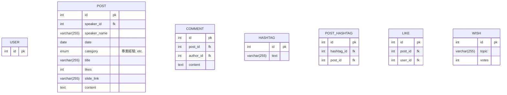

```mermaid
erDiagram

USER {
    int id pk
    %% what else?
}

POST {
    int id pk
    int speaker_id fk
    varchar(255) speaker_name
    date date
    enum category "專案經驗, etc."
    varchar(255) title
    %% This is denormalization because likes is stored in both posts and likes
    %% By doing this, when like/unlike we have to update this field and modify a record in likes
    %% The benefit is when the frontend want to list the posts, it could get the likes here instead of query the likes table to calculate the likes for every post
    int likes
    varchar(255) slide_link
    text content
}

COMMENT {
    int id pk
    int post_id fk
    int author_id fk
    text content
}

HASHTAG {
    int id pk
    varchar(255) text 
}

POST_HASHTAG {
    int id pk
    int hashtag_id fk
    int post_id fk
}

LIKE {
    %% when a user click like button, create a record(like) or delete a record(unlike) 
    int id pk
    int post_id fk
    int user_id fk
}

WISH {
    int id pk
    varchar(255) topic
    int votes 
}


```